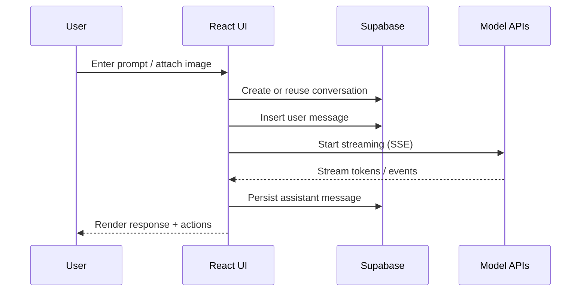
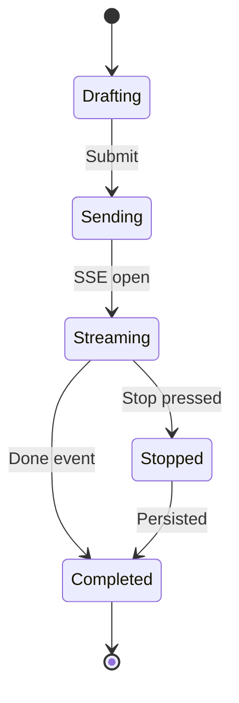
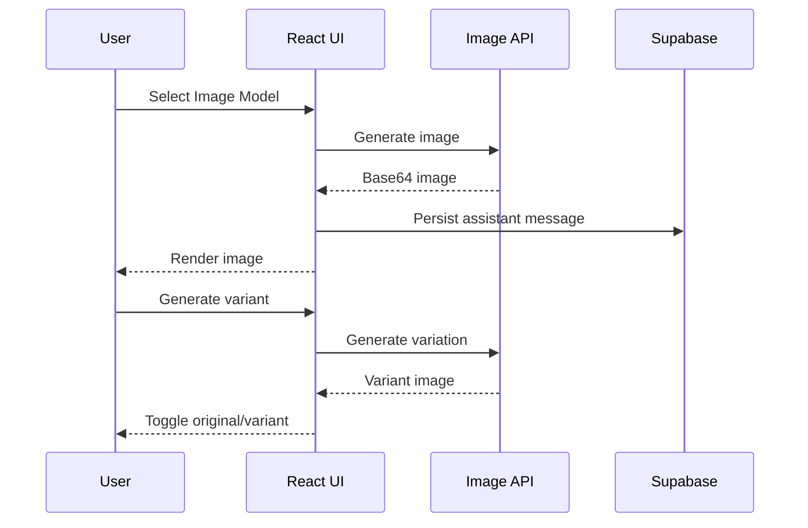
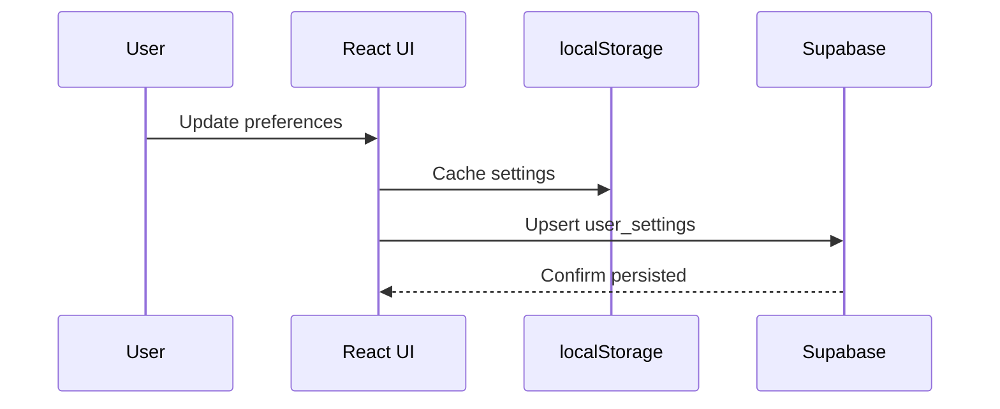
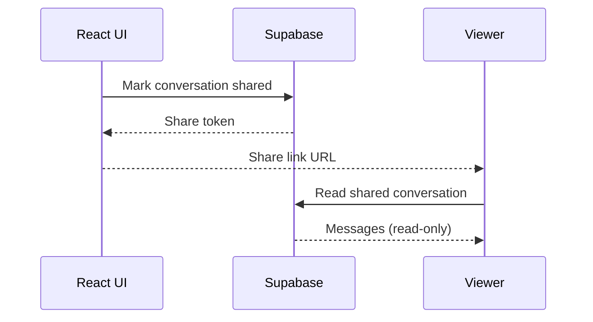
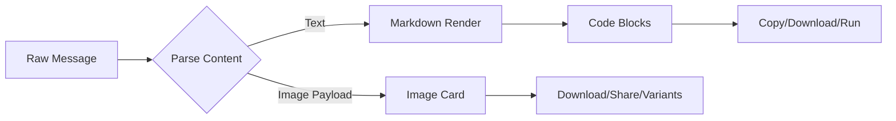
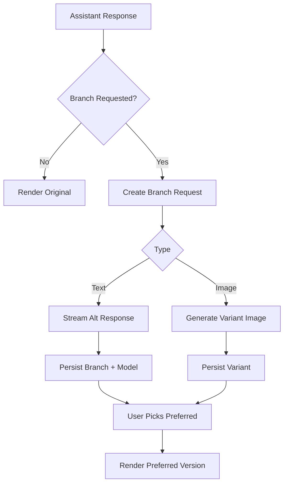
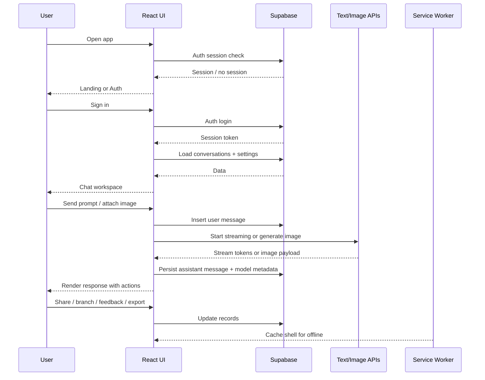
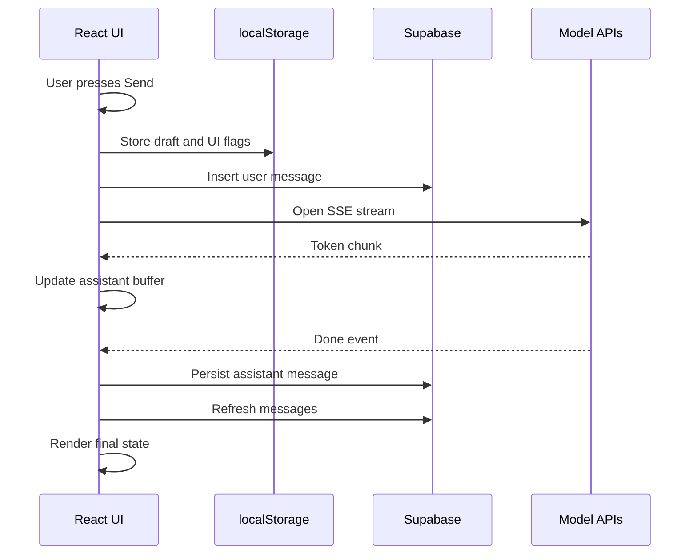

# Llama AI Frontend

A production-grade AI chat interface that combines streaming LLM responses, multimodal image workflows, and Supabase-backed persistence. The app is a single-page React experience with a full dashboard, a shared-link viewer, and a dedicated gallery for generated images.

Live demo: https://llama-ai-pi.vercel.app

## What This Project Is

Llama AI is a complete chat client for AI assistants. It focuses on:

- Fast, streaming interactions for text and image models
- Durable chat history with per-user settings stored in Supabase
- Power-user tooling like branching responses, model switching, code execution, and message sharing
- A polished UI with voice input, read-aloud playback, and PWA support

The full UI and behavior are defined in [src/App.tsx](src/App.tsx). The database schema is defined in [supabase/schema.sql](supabase/schema.sql).

## Top Stack Layers (UI -> Data -> Services)

1) UI Layer (React + Router)
   - View composition, routing, and interaction states live in [src/App.tsx](src/App.tsx).
   - UI state is synchronized with localStorage for fast rehydration.

2) Data Layer (Supabase)
   - Auth, conversation storage, messages, and user preferences are stored in Supabase.
   - RLS policies gate data access. See [supabase/rls_policies.sql](supabase/rls_policies.sql).

3) Streaming + Media Services
   - Text and vision responses stream through SSE endpoints.
   - Image generation uses a REST-style endpoint that returns base64 payloads.
   - Code execution streams output via SSE for supported languages.

4) Utility Services
   - Title generation service creates readable conversation titles.
   - Service worker provides offline-capable shell caching.

## Product Flow (End-to-End)

1) Landing and Auth
   - The landing page routes unauthenticated users to sign in.
   - Email/password and Google OAuth are supported via Supabase Auth.
   - The auth screen blocks access if Supabase is misconfigured.

2) Conversation Lifecycle
   - On first entry to chat, the app creates or resumes a conversation.
   - Conversations are ordered by last activity and titled automatically.
   - Conversations can be deleted or shared via public links.

3) Message Send and Streaming
   - User input is persisted locally to keep the UI responsive.
   - Requests are streamed via SSE for text models or handled as image workflows.
   - A stop action is available at any time and triggers backend stop endpoints.

4) Response Enhancement
   - Responses are rendered in Markdown with syntax highlighting.
   - Code blocks support copy, download, and optional server-backed execution.
   - Users can branch responses and choose preferred variants.

5) Settings and Personalization
   - A dashboard configures response style, prompt purpose, voice, and privacy.
   - Settings are cached locally and synced to Supabase for consistency.

6) Sharing and Gallery
   - Conversations can be shared publicly using a unique share token.
   - The shared view is read-only but still supports feedback and read-aloud.
   - The gallery aggregates generated images across conversations.

## Core Features (Detailed)

### Authentication

- Email/password sign-up and sign-in
- Google OAuth sign-in
- Auth status gates all protected routes
- Supabase key role validation prevents unsafe keys

### Conversations and Messages

- Persisted conversations with activity sorting
- Auto-generated titles from a title API
- Server-synced message history with local streaming placeholders
- Message feedback with like/dislike
- Generation timing capture per assistant response

### Streaming Responses

- Token-level streaming for text models
- Image analysis streaming for vision inputs
- Stop controls for each model family
- Defensive handling for partial or malformed SSE payloads

### Multi-Model Composer

- Llama, Fast, and Coder for text
- Image mode for generation
- Per-message model badges and stored model metadata

### Image Workflows

- Image upload for analysis prompts
- Image generation via a dedicated API
- Image variants (branching) to compare alternative outputs
- Dedicated gallery view for generated images

### Branching and Variants

- Alternate responses can be requested per assistant message
- Text branches are stored and selectable
- Image variants can be generated and toggled
- Preferences are cached locally for quick reuse

### Markdown and Code UX

- GitHub-flavored Markdown rendering
- Syntax-highlighted code blocks
- Copy and download for code blocks
- Optional code execution panel (server-backed)

### Voice and Accessibility

- Voice typing via browser speech recognition
- Read-aloud playback with selectable voices
- Live progress indicators for read-aloud playback

### Sharing

- Public share links for conversations
- Social share actions (messages, email, WhatsApp, Telegram)
- OS share sheet support where available

### PWA Support

- Manifest and service worker for installability
- App shell caching with network-first strategy

## Architecture and Responsibilities

### Application Entry

- Vite bundles the app and injects it into the root element.
- Service worker is registered in production only.

### Routing

- `/` landing page
- `/auth` authentication
- `/chat` main chat workspace
- `/dashboard` settings and account view
- `/gallery` image gallery
- `/shared/:shareToken` public, read-only share view

### Data Layer

- Supabase JS client handles Auth + Postgres reads/writes.
- Client caches are stored in localStorage for quick rehydration.
- RLS policies are required to protect user data and shared links.

### Streaming Layer

- SSE stream reader parses `data:` payloads and emits tokens.
- Image streams support a separate event for `vision_done`.
- Stop endpoints are called to terminate active streams.

### UI State

- Long-running state is colocated in [src/App.tsx](src/App.tsx).
- The chat view manages the main UI lifecycle and streaming updates.
- The dashboard view manages preferences and syncs them to Supabase.

## State and Flow (Animated Docs)

### Main Conversation Flow

### Message State Machine

### Image Generation and Variant Flow

### Settings Sync Flow

### Share Link Lifecycle

### Chat Rendering Pipeline

### Branching Logic Flow (Text + Image)

### Complete App Working Flow

### Event Timeline (Client-Side)

## Data Model (Supabase)

The schema is defined in [supabase/schema.sql](supabase/schema.sql). Key tables:

### conversations

- `id` uuid
- `user_id` uuid
- `title` text
- `is_shared` boolean
- `share_token` text
- `last_used_at` timestamptz
- `created_at` timestamptz

### messages

- `id` uuid
- `conversation_id` uuid
- `role` text (`user`, `assistant`, `system`)
- `content` text (plain or JSON payload for images)
- `parent_id` uuid (branching)
- `branch_id` integer
- `feedback` text (`like`, `dislike`)
- `model` text (text model)
- `model_used` text (text or image model)
- `generation_ms` integer
- `created_at` timestamptz

### user_settings

- `user_id` uuid
- `display_name` text
- `theme` text (`light`, `dark`)
- `response_style` text
- `prompt_purpose` text
- `enter_to_send` boolean
- `read_after_send` boolean
- `suggestion_count` smallint
- `voice_language` text
- `read_voice_uri` text
- `confirm_clear_chats` boolean
- `chat_export_enabled` boolean
- `data_analytics_enabled` boolean

## Response Payloads

The app supports both plain text and JSON payloads for messages:

- Text payloads are stored as plain strings.
- Image payloads are stored as JSON:
  - `{ "type": "image", "data": "<base64>", "prompt": "...", "model": "sd-turbo" }`

The parser detects and normalizes content for display, branching, and gallery views.

## Services and External APIs

- Chat model APIs: text streaming SSE endpoints
- Image generation API: JSON response with base64 payload
- Image analysis API: SSE stream for vision prompts
- Title API: generates short conversation titles
- Code runner API: SSE output for code execution

All API bases are configurable via `VITE_*` variables.

## Tech Stack

- React 19 + TypeScript
- Vite 8
- Supabase JS (Auth + Postgres)
- React Router
- React Markdown + Remark GFM + Syntax Highlighter
- Lucide + React Icons

Official docs:
- React: https://react.dev/
- Vite: https://vitejs.dev/
- Supabase: https://supabase.com/

## Key Files

- [src/App.tsx](src/App.tsx) app logic and UI flows
- [src/index.css](src/index.css) global theming and layout
- [public/service-worker.js](public/service-worker.js) PWA caching
- [supabase/schema.sql](supabase/schema.sql) data model
- [supabase/rls_policies.sql](supabase/rls_policies.sql) RLS policies

## Architecture Diagram (Logical)

Client UI
  -> Auth (Supabase)
  -> Conversations + Messages (Supabase)
  -> Streaming APIs (SSE)
  -> Image Generation (REST)
  -> Title Service (REST)
  -> Code Runner (SSE)

Supabase
  -> Auth users
  -> conversations
  -> messages
  -> user_settings

## What Makes This Implementation Distinct

- Single-file UI architecture for ease of audit and iteration
- Branching system for both text and images
- Robust share flow with read-only shared pages
- Tight integration between generation state and UI affordances
- Built-in code execution panel for runnable snippets

## Design and UX Principles

- Streaming first: responses appear immediately as they arrive
- Minimize friction: shortcuts, quick actions, and model toggles
- Safe defaults: RLS protection and anon-key enforcement
- Multi-modal parity: image and text workflows have feature parity
